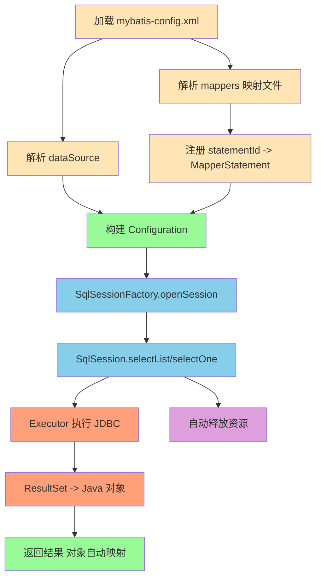

<Boxx/>

本文带你从 JDBC 的原始代码出发，抽象出一个 “迷你版 MyBatis” 框架的核心组件设计与协作关系，为后续实现与优化打下基础。

<!-- more -->

[[toc]]

## 回顾 JDBC

JDBC 的基本使用流程：

- 加载驱动与获取连接
- 准备 SQL 与编译 `PreparedStatement`
- 绑定参数并执行
- 解析结果集 `ResultSet`，将行数据封装到对象
- 释放连接、语句、结果集

下面是本项目中的 JDBC 代码用例，直观展示 “模板化、重复、易错” 的痛点：

```java
public class JDBCTest {

    @Test
    public void test() throws Exception {
        Connection connection = null;
        PreparedStatement preparedStatement = null;
        ResultSet resultSet = null;
        try {
            // 1.加载驱动
            Class.forName("com.mysql.jdbc.Driver");

            // 2.获取连接
            connection = DriverManager.getConnection("jdbc:mysql://localhost:3306/test", "root", "12345678");

            // 3.定义sql语句，创建statement
            String sql = "select * from user where name = ?";
            preparedStatement = connection.prepareStatement(sql);
            // 设置参数
            preparedStatement.setString(1, "张三");

            // 4.执行sql，查询出结果集
            resultSet = preparedStatement.executeQuery();
            // 遍历查询结果集
            while (resultSet.next()) {
                int id = resultSet.getInt("id");
                String username = resultSet.getString("name");
                // 5.根据结果集，封装User
                User user = new User();
                user.setId(id);
                user.setName(username);
                System.out.println(user);
            }
        } catch (Exception e) {
            e.printStackTrace();
        } finally {
            // 6.释放资源
            if (resultSet != null) {
                try {
                    resultSet.close();
                } catch (SQLException e) {
                    e.printStackTrace();
                }
            }
            if (preparedStatement != null) {
                try {
                    preparedStatement.close();
                } catch (SQLException e) {
                    e.printStackTrace();
                }
            }
            if (connection != null) {
                try {
                    connection.close();
                } catch (SQLException e) {
                    e.printStackTrace();
                }
            }
        }
    }

}
```

可以看到（缺点）：
- 配置信息硬编码（驱动、URL、账号密码）
- 连接/关闭样板代码冗长
- SQL 与映射逻辑写死，复用差
- 结果集到对象的映射易错、繁琐

## 我们要做什么（目标 Mybatis）

| 核心操作                                                     | 层次分明 |
| ------------------------------------------------------------ | -------- |
| 将数据源配置从代码中抽离到 XML                               | 用户层   |
| 将 SQL 从代码中抽离到 mapper.xml，并为其定义唯一的 statementId | 用户层   |
| 通过 `SqlSession` 暴露统一的数据库操作 API                   | 框架层   |
| 用 `Executor` 屏蔽底层 JDBC 细节                             | 框架层   |
| 支持 `#{}` 占位符与参数映射                                  | 框架层   |

可以看到，优化之后，对于用户来说：只需要定义好 `数据源配置` 和 `mapper.xml` sql 即可。其他都交给框架解决。大大简化了 JDBC 操作。

## Mybatis 加载流程

Mybatis 的整个加载与执行流程可以拆分为以下几个核心步骤，每步对应特定的类与职责：

1. **加载全局配置文件 (`mybatis-config.xml`)**
   - 主要由 `XMLConfigBuilder` 实现，负责从 classpath 加载配置文件，并解析 `<dataSource>` 和 `<mappers>` 配置。

2. **解析 mapper 文件 (`mapper/*.xml`)**
   - `XMLMapperBuilder` 解析每个 Mapper 文件，读取 SQL、参数类型、结果类型等，注册到全局的 `Configuration` 中（`statementId` 映射到对应的 `MapperStatement` 对象）。

3. **通过工厂获得 SqlSession（会话）**
   - 用户通过 `SqlSessionFactoryBuilder` 创建 `SqlSessionFactory`，再通过工厂方法 `.openSession()` 获取 `SqlSession`，SqlSession 对外暴露了增删改查的 API。

4. **执行 SQL：selectList / selectOne / update / delete**
   - 用户调用 `SqlSession` 的方法（如 `selectList`），内部会通过 `Executor` 执行 SQL。
   - 参数解析和 `#{}` 占位符替换工作由框架自动完成，用户传入参数实体即可。

5. **结果映射绑定 Java 对象**
   - JDBC 查询返回的 `ResultSet` 结果，框架自动将其映射到 Java POJO，通过反射或内省机制自动注入属性。

6. **自动释放资源**
   - 框架在会话关闭时，自动关闭数据库连接、预编译语句、结果集等，避免资源泄漏。

流程结构示意如下：



通过这样的设计，Mybatis 实现了**配置、SQL、映射、执行、资源释放**各自分离、协作的优秀架构。

## MyBatis 核心角色

- 配置文件（用户层）
  - `mybati-config.xml`：Mybatis 配置文件（数据源、mapper位置等）
  - `mapper.xml`：sql 模板文件

- 配置解析
  - `XMLConfigBuilder`：解析 `mybatis-config.xml`，构建 `Configuration`
  - `XMLMapperBuilder`：解析 `mapper/*.xml`，构建 `MapperStatement`
- 核心对象
  - `Configuration`：数据源与 `statementId -> MapperStatement` 的注册表
  - `MapperStatement`：封装 SQL、参数类型、返回类型、命令类型
- 会话与工厂
  - `SqlSessionFactoryBuilder` -> `SqlSessionFactory` -> `SqlSession`
- 执行器
  - `Executor` 接口与 `SimpleExecutor` 实现：负责 JDBC 执行与结果映射、资源释放等
- 实用工具
  - `Resources`：从 classpath 读取资源
  - `GenericTokenParser` 等：解析 `#{}` 并记录参数映射

## 配置文件长什么样？

配置（示例）：

```xml
<configuration>
    <!--数据源配置-->
    <dataSource>
        <property name="driverClassname" value="com.mysql.jdbc.Driver"></property>
        <property name="url" value="jdbc:mysql://localhost:3306/test"></property>
        <property name="username" value="root"></property>
        <property name="password" value="12345678"></property>
    </dataSource>
    <!--mapper文件配置-->
    <mappers>
        <mapper resource="mapper/UserMapper-01.xml"/>
        <mapper resource="mapper/UserMapper-02.xml"/>
    </mappers>
</configuration>
```

以及一个 mapper 示例：

```xml
<mapper namespace="user">
    <!--查询所有-->
    <select id="selectList" resultType="com.snail.source.mybatis.entity.User">
        select *
        from user
    </select>
    <!--查询单个-->
    <select id="selectOne" resultType="com.snail.source.mybatis.entity.User"
            parameterType="com.snail.source.mybatis.entity.User">
        select * from user where id = #{id} and name = #{name}
    </select>
</mapper>
```

## 小结

- 通过抽象出 `Configuration / MapperStatement / SqlSession / Executor` 等角色和层次，我们把“重复且易错”的 JDBC 模板提炼为可复用、可扩展的迷你框架。
- 下一篇将实现一个完整的 Mybatis 框架，实现这些类的运行闭环：从加载配置，文件解析，到执行查询并返回实体列表。

<Reward/>